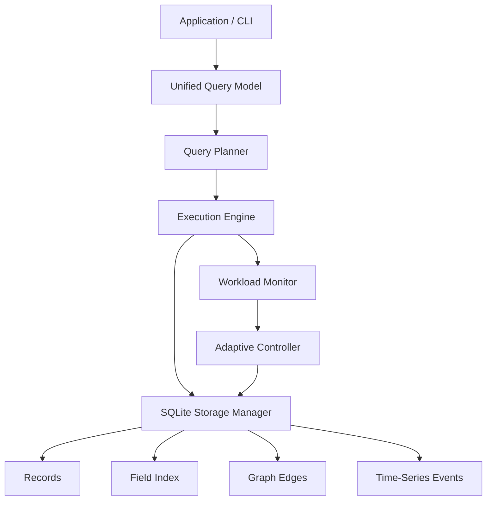

# AMMO-DB Project Report

## Title

AMMO-DB: An Adaptive Multi-Model Database Engine for Workload-Aware Physical Layout Selection

## Abstract

AMMO-DB studies how a database can expose one logical interface for relational, document, graph, and time-series data while adapting its internal physical design to workload changes. The prototype stores all data durably in SQLite-backed physical structures, collects query-shape statistics, classifies collection behavior, creates adaptive secondary indexes, and routes logical queries through a small cost-based planner.

The current implementation is a compact research prototype. Its value is not that it replaces specialized databases, but that it gives a concrete implementation platform for experimenting with adaptive physical design in multi-model systems.

## Motivation

Applications increasingly mix data models:

- user/account data behaves like relational rows,
- product or article data behaves like JSON documents,
- social or dependency data behaves like graphs,
- telemetry behaves like time-series data.

Traditional systems either force the application into one model or provide multiple models with manually tuned physical design. AMMO-DB asks whether the DBMS can infer the right physical strategy from observed workload behavior.

## Contributions

1. A unified logical query abstraction over four data models.
2. SQLite-backed physical structures for records, field indexes, graph edges, and time-series events.
3. A planner that maps logical query intent to physical operators.
4. Workload monitoring over query kind and predicate fields.
5. An adaptive controller that classifies collections and creates indexes based on workload frequency.
6. A runnable demo, CLI, test suite, and experimental benchmark.

## System Design

## Logical Model

The `Query` object captures model-neutral intent:

- `where` expresses relational/document selection.
- `project` expresses projection.
- `start_node`, `edge_label`, and `depth` express graph traversal.
- `metric`, `time_from`, `time_to`, and `aggregate` express time-series queries.

## Physical Operators

AMMO-DB currently supports:

- `record_scan`
- `document_predicate_scan`
- `indexed_record_lookup`
- `graph_traversal`
- `timeseries_range_scan`

## Adaptation Algorithm

For each collection:

1. Read workload statistics from `workload_log`.
2. Count dominant query kind.
3. Classify layout as `row`, `document`, `graph`, `timeseries`, or `hybrid`.
4. Create a field index when a predicate field appears at least three times.
5. Drop field indexes that are no longer used in the observed workload window.

The current policy is intentionally simple and inspectable. A PhD version could replace this with:

- a learned cost model,
- a contextual bandit,
- reinforcement learning,
- Bayesian workload classification,
- or regret-bounded online physical design.

## Evaluation Plan

Recommended experiments:

1. **Selection-heavy workload**
   Measure predicate query latency before and after adaptive index creation.

2. **Workload shift**
   Query `city` repeatedly, adapt, then shift to `role`; observe index migration.

3. **Hybrid workload**
   Mix selection, graph, and time-series queries against one collection family and evaluate hybrid classification.

4. **Baseline comparison**
   Compare against static scan-only execution.

5. **Maintenance cost**
   Measure insertion cost with and without adaptive indexes.

## Limitations

- SQLite is used as a substrate, not replaced by a full storage engine.
- Layout migration is represented through metadata and indexes rather than separate page formats.
- The cost model is heuristic.
- Query language is Python/CLI structured queries rather than SQL.
- Graph and time-series operators are minimal.

## Thesis-Grade Extensions

1. Implement real physical layouts: row store, column store, JSON trie, compressed adjacency lists, and time partitions.
2. Add a formal cost model with learned cardinality estimation.
3. Add online migration with bounded foreground query disruption.
4. Add a workload generator and benchmark suite.
5. Add declarative SQL-like syntax that compiles into the unified query model.
6. Publish results against mixed workloads such as HTAP plus graph and telemetry.

